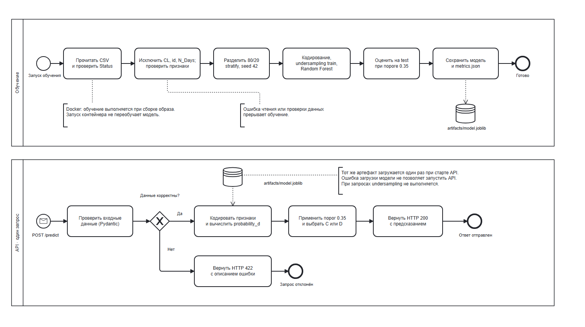

# Модель в техническом процессе

Сервис включает отдельное обучение и обработку запросов на предсказание.
Их связывает сохранённый артефакт `artifacts/model.joblib`.

[Редактируемый BPMN](docs/process.bpmn) · [Векторная версия](docs/process.svg).

## Роль модели

Random Forest по признакам одной записи оценивает вероятность класса `D`
и позволяет выбрать записанный исход: `C` — цензурированное наблюдение,
`D` — смерть. Это учебная классификация исхода, а не прогноз времени до события.
В процессе API модель применяется после проверки входных данных.

## Почему используется ML

Есть размеченные табличные данные с числовыми и категориальными признаками.
Random Forest может обучаться нелинейным зависимостям и сочетаниям признаков,
которые трудно описать небольшим набором ручных правил.
Отложенная выборка позволяет измерить качество такого подхода;
преимущество над медицинскими шкалами в проекте не проверялось.

## Входные данные

Клиент отправляет в `POST /predict` JSON с 17 признаками: возрастом, полом,
препаратом, клиническими признаками, лабораторными показателями и стадией заболевания.
Поля и единицы соответствуют [карточке модели](model_card.md);
[пример запроса](examples/predict_request.json) содержит полный набор полей.
`Status`, `id` и `N_Days` в запрос не входят.
Неверные данные отклоняются с HTTP 422; корректные проходят кодирование признаков
и передаются модели. Балансировка классов применяется только при обучении.

## Использование результата

К вероятности `probability_d` применяется сохранённый порог 0.35:
значение не ниже порога даёт `D`, иначе — `C`.
API возвращает клиенту HTTP 200 и JSON с полями `predicted_class`,
`predicted_status`, `probability_d` и `threshold`.
Пользователь просматривает ответ через `/docs` или HTTP-клиент;
автоматические медицинские действия в проекте не предусмотрены.

Модель загружается один раз при запуске API. Для локального запуска её предварительно
обучают командой из [README](README.md#данные-и-обучение);
в Docker обучение выполняется при сборке образа, а не при каждом запросе.
